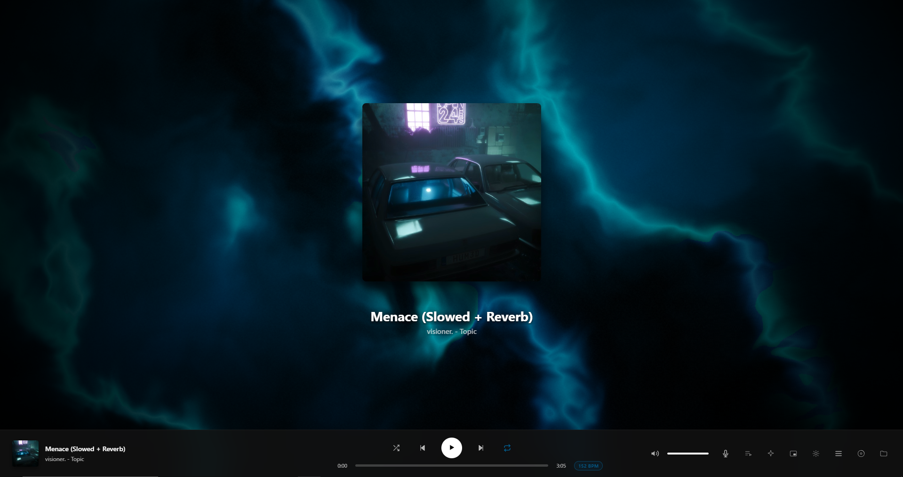
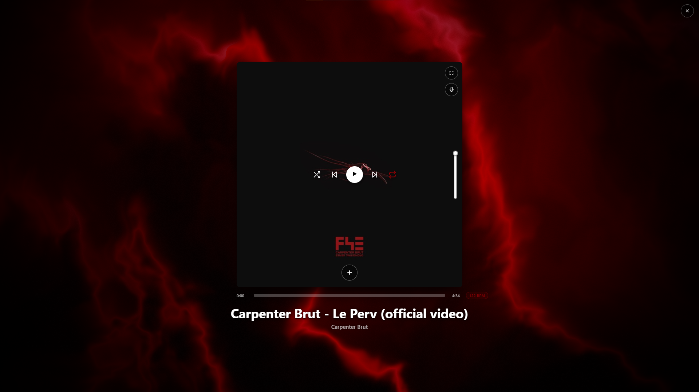

# 🌌 Pulsar — Desktop Music Player

A free, portable music player for **Windows 10/11** with a pulsar-nebula soul: search YouTube, save full tracks **with cover art and tags embedded**, sing along with synced lyrics, and watch audio-reactive 3D visualizers. No installer, no command line — one folder that just runs.

**⬇ [Download the latest ZIP](https://ursusel.github.io/Pulsar-Desktop/)** *(or grab [`Pulsar-Desktop.zip`](../../raw/main/Pulsar-Desktop.zip) straight from this repo)*

  

## ✨ Features

- 🎧 **Built-in YouTube downloader** — yt-dlp ships inside the app and starts itself in the background
- 🖼️ **Covers & tags embedded** — saved tracks look right in Explorer, your phone, any player
- 🌠 **Nebula visualizers** — audio-reactive 3D backgrounds, fullscreen ambient mode
- 🎤 **Synced lyrics** — elegant column, buttery-smooth in fullscreen
- ⏱️ **Sleep timer & stats** — gentle fade-out, favorites, play counts, smart sorting
- 🔌 **Truly portable** — keep it on any drive, even a USB stick

## 📸 Screenshots

| Player view | Fullscreen ambient |
|---|---|
|  |  |

## 🚀 Run it in three steps

1. **Download & unpack** — extract the whole `Pulsar` folder anywhere (e.g. `C:\Pulsar`).
2. **Double-click `pulsar.exe`** — if SmartScreen appears: *More info → Run anyway* (only once).
3. **Play & save** — drop local files in, or open the *Net* tab and paste a YouTube link. Songs arrive with cover art, ready to keep or save to any folder on disk.

## 🛠️ Tech

Single-file web app (vanilla JS + WebGL shaders) wrapped with [Neutralino.js](https://neutralino.js.org) (WebView2) — ~20 MB, no Electron, no Node.js required at runtime. Downloads powered by the bundled [yt-dlp](https://github.com/yt-dlp/yt-dlp).

## 🧩 Source code & building

The app source lives in [`app/`](app/) (recovered 1:1 from `resources.neu`, SHA-256 verified):

```
app/
├─ neutralino.config.json    # window, permissions, version
└─ resources/
   ├─ index.html             # the whole player (HTML + CSS + JS, single file)
   ├─ desktop.js             # desktop layer: runs yt-dlp.exe, file system, window
   ├─ neutralino.js          # Neutralino client library 6.9.0
   └─ icons/appIcon.png
```

Rebuild `resources.neu` after editing (Python 3 only, no Node.js needed):

```bash
python tools/neu.py pack app resources.neu     # folder  -> resources.neu
python tools/neu.py unpack resources.neu app   # resources.neu -> folder
python tools/neu.py verify resources.neu       # check SHA-256 integrity
```

Then put `pulsar.exe` + `resources.neu` + `yt-dlp.exe` in one folder and run `pulsar.exe`.
`pulsar.exe` is the stock Neutralino 6.9.0 Windows binary, so it never needs rebuilding.
Packing is deterministic: an unmodified `app/` produces a byte-identical `resources.neu`.

---

*Please respect the artists you love — use the YouTube features responsibly.*
